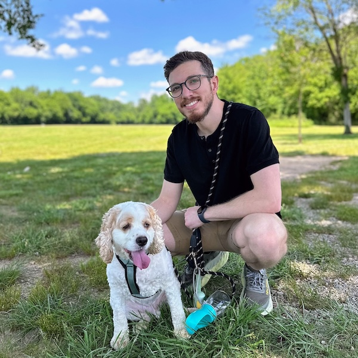

---
hide:
  - navigation
  - toc
---

<h1 style="text-align: center;">welcome.</h1>

  

    
    
We don't talk about Bruno

  

   
  

    
👋 Hi! I'm Aldo, an Android Engineer at Square. I'm building product experiences that empower millions of sellers worldwide. I've taught mobile development at Meta and Google, focused on empowering underrepresented groups in tech through teaching and mentoring.

    
I love to share what I learn by <a href="speaking"><b>speaking at events</b></a> and <a href="blog"><b>writing random thoughts</b></a>.

  

